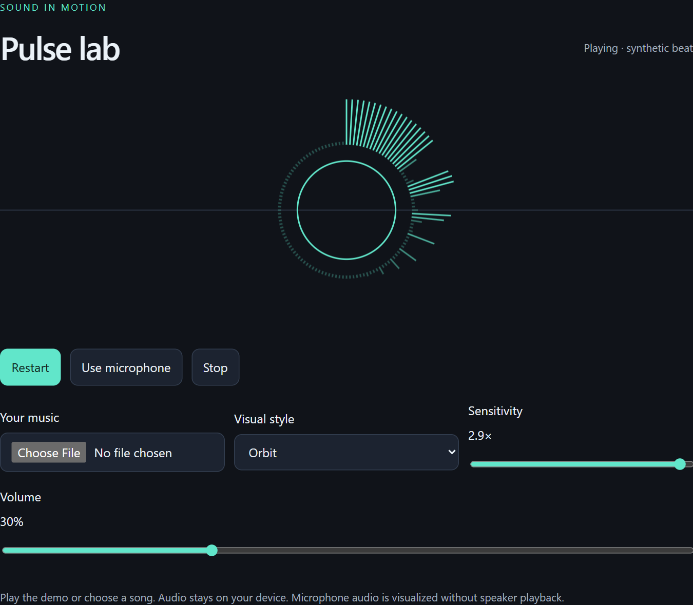
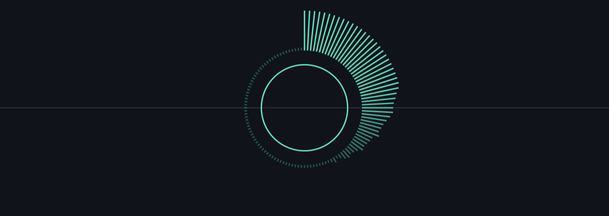
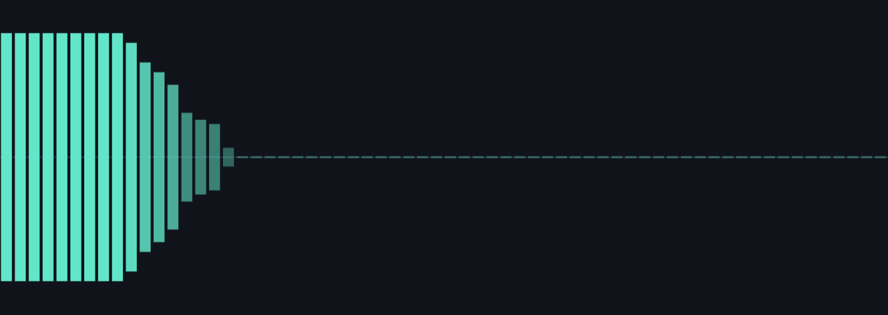
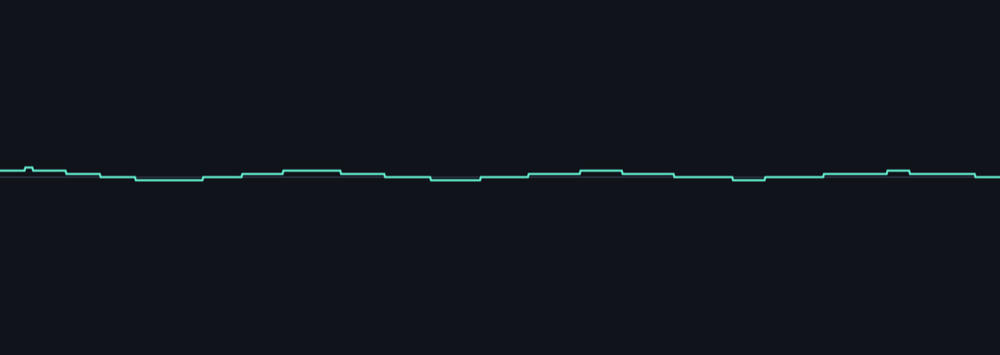

<div align="center">

# Pulse Lab

### Sound in motion.

Turn your music into an orbit, a spectrum, or a living waveform.

**Vanilla JavaScript · Web Audio · Canvas · No build step**

[Get started](#get-started) · [Explore the visuals](#three-ways-to-see-sound) · [Make it your own](#make-it-your-own)

</div>

<picture>
  <source media="(prefers-color-scheme: dark)" srcset="docs/images/pulse-lab-dark.png">
  <source media="(prefers-color-scheme: light)" srcset="docs/images/pulse-lab-light.png">
  
</picture>

<p align="center"><sub>Actual app screenshot · built-in demo playing · light and dark themes</sub></p>

## Three ways to see sound

| Orbit | Spectrum | Waveform |
| :---: | :---: | :---: |
|  |  |  |
| Frequency energy arranged in a ring. | Low to high frequencies as vertical bars. | The shape of the audio signal over time. |

## Pick your source. Find your rhythm.

| Input | What you can do |
| --- | --- |
| **Play demo** | Start immediately with a synthesized beat. No music file needed. |
| **Your music** | Open an MP3, WAV, or another format your browser supports. |
| **Use microphone** | Visualize live sound without routing microphone audio to the speakers. |

Adjust **sensitivity** to amplify the visual response and **volume** to change demo or music playback loudness. Your style, sensitivity, and volume settings are remembered when browser storage is available.

**Your audio stays on your device.** Pulse Lab processes audio locally. It does not upload or record it, and it needs no account or API keys.

## Get started

### Open and play

Download this repository using **Code → Download ZIP**, extract it, and open `index.html` in your browser. Click **Play demo** or choose an audio file, then click **Play track**.

### Run on localhost

For microphone use, serve the project locally with Python:

```sh
git clone https://github.com/RedThunder27112/pulse-lab.git
cd pulse-lab
python -m http.server 8000 --bind 127.0.0.1
```

Open **[localhost:8000](http://localhost:8000)** and press **Use microphone**. Allow microphone access when prompted. **Stop** ends playback and releases the microphone.

> Microphone access requires browser support, permission, and a secure context such as localhost or HTTPS. The volume slider controls demo and music playback; it does not change microphone capture volume.

## How it works

The Web Audio API reads an audio source through an analyser. Canvas draws its frequency or waveform data in the selected visual style. Everything runs in the browser, with no server-side audio processing or runtime libraries.

```text
Demo beat / audio file / microphone
                 │
           Web Audio analyser
                 │
         Canvas visualization
       Orbit · Spectrum · Waveform
```

## Make it your own

| File | What to change |
| --- | --- |
| [`index.html`](index.html) | Page content and accessible controls |
| [`styles.css`](styles.css) | Colors, responsive layout, and light/dark themes |
| [`app.js`](app.js) | Audio sources, rendering, and saved settings |
| [`docs/images/`](docs/images/) | Screenshots used in this README |

### Hosting

Serve the repository root with any static host. The project is also ready for GitHub Pages using the root of the `main` branch. No build command is needed. Use HTTPS for microphone access.

---

<p align="center"><sub>Started as an interactive chat experiment. Now a standalone browser project.</sub></p>
